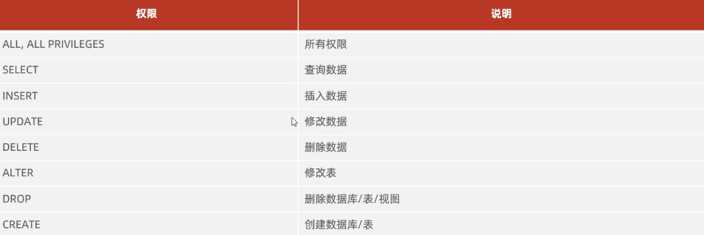

# DCL

1. 查询用户  
    ```
   USE mysql;
   SELECT * FROM user;
   ```
2. 创建用户
    ```
   CREATE USER '用户名'@'主机名' IDENTIFIED BY '密码';
   ```
3. 修改用户密码
    ```
   ALTER USER ''@'' IDENTIFIED WITH mysql_native_password BY '新密码';
   ```
4. 删除用户
    ```sql
    DROP USER '用户名'@'主机名';
    ```
5. 权限控制
    * 查询权限
        `SHOW GRANTS '用户名'@'主机名';`
    * 授予权限
        `GRANT 权限列表 ON 数据库名.表名 TO '用户名'@'主机名'`
    * 撤销权限
        `REVOKE 权限列表 ON 数据库名.表名 FROM '用户名'@'主机名'`

