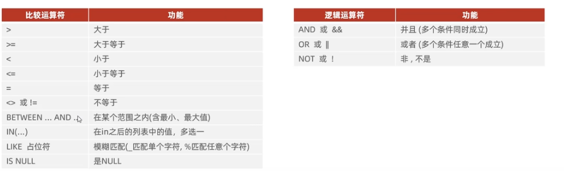
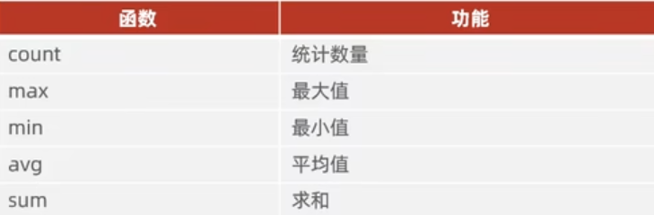
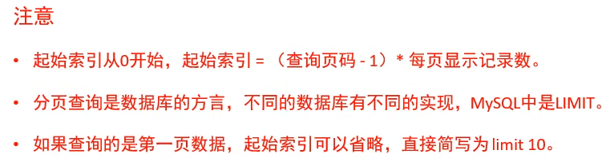

# DQL 数据库查询操作

关键字 
`SELECT` : 字段列表

`FROM` : 表明列表

`WHERE` : 条件列表 (条件查询)

`GROUP BY` : 分组字段列表 (分组查询)

`HAVING` : 分组后条件列表

`ORDER BY` : 排序字段列表 (排序查询)

`LIMIT` : 分页参数 (分页查询)

聚合查询(`count`, `max`, `min`, `avg`, `sum`)

### 条件查询多个字段  , 中括号[]内为可选参数

`SELECT 字段1 [as 别名1], 字段2 [as 别名2],字段3 [as 别名3],··· FROM 表名;`
`SELECT * FROM 表名 WHERE 条件1 and 条件2;`

去除重复记录 [distinct]  

`SELECT [DISTINCT] 字段列表 FROM 表名 WHERE 条件1 and 条件2;`



### 聚合查询


`SELECT 聚合函数(字段列表) FROM 表名;`
不计算NULL值
```sql  
SELECT COUNT(*) FROM TABLE_NAME;
SELECT AVG(age) FROM TABLE_NAME;
SELECT count(*) FROM TABLE_NAME where age>30;
```

### 分组查询

`SELECT 字段列表 from 表名 [WHERE 条件] GROUP BY 分组字段名 [HAVING 分组后过滤条件];`

* where 与 having的区别：
  * where 是分组之前进行过滤，不满足where条件的不参与分组；
  * 而having是分组之后对结果进行过滤；
  * where 不能对聚合函数进行判断，而having可以

### 排序查询

`SELECT 字段列表 FROM 表名 ORDER BY 字段1 排序方式1, 字段2 排序方式2;`

ASC:升序(默认)
DESC:降序

### 分夜查询

`SELECT 字段列表 FROM 表名 LIMIT 起始索引, 查询记录数;`




### 多表查询

#### 内连接  两张表相交的部分
* 隐式内连接

select 字段列表 from 表1, 表2 where 条件 ···;

```sql
select *
from table_1 t1,
     table_2 t2
where t1.foreign_id = te.id;
```

* 显式内连接

select 字段列表 from 表1 [inner] join 表2 on 连接条件···;

```sql
select *
from table_1 t1
         inner join table_2 t2 on t1.foreign_id = te.id;
```

#### 外连接
* 左外连接 (t1 + t1&&t2)

select 字段列表 from 表1 left [outer] join 表2 on 连接条件;

```sql
select t1.name, t2.name
from table_1 t1
         left join table_2 t2 on t1.foreign_id = t2.id;
```

* 右外连接 (t1&&t2 + t2)

select 字段列表 from 表1 right [outer] join 表2 on 连接条件;

```sql
select t1.name, t2.name
from table_1 t1
         right join table_2 t2 on t1.foreign_id = t2.id;
```

#### 子查询

形式: `select * from t1 where column1 = (select column1 from t2 ...);`

* 标量子查询

查询'xxx'的所有员工信息
```sql
select *
from t1
where foreign_id = (select id 
                    from t2 
                    where name = 'xxx');
```

* 列子查询

查询‘xxx' 和 ’yyy‘ 的所有员工信息
```sql
select *
from t1
where t1id in (select id 
               from t2 
               where name = 'xxx' or name = 'yyy');
```

* 行子查询

查询 '' 的 job 和 address 都相同的员工信息
```sql
select *
from t1
where (address, job) = (select address, job 
                        from t2 
                        where name = 'xxx');
```

* 表子查询

查询入职日期是 '2006-01-01' 的所有员工信息及其部门名称

```sql
select e.*, d.name
from (select * from t2 where enrydata > '2006-01-01') e,
     t2 d
where e.foreign_id = d.id;
```

