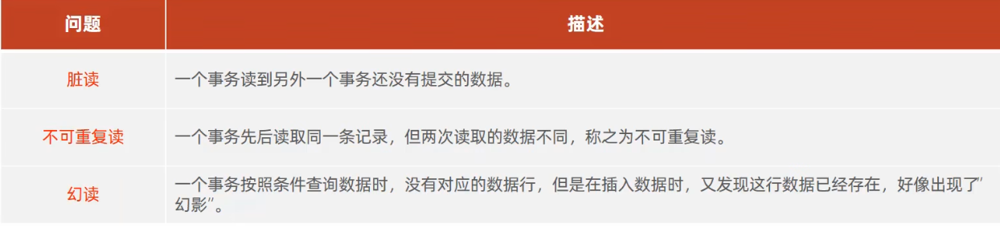
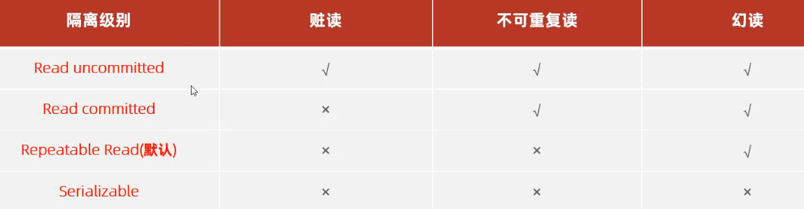

# 事务
方式一
```sql
select @@autocommit; -- 查询事务提交方法
set @@autocommit=0;  -- 改为手动提交;
```

方式二
```sql
start transaction ;     -- 开启事务
begin;
```

```sql
commit;     --事务提交
rollback ;  --回滚事务
```

事务四大特性
* 原子性(Atomicity):事务是不可分割的最小操作单元，要么全部成功，要么全部失败。
* 一致性(Consistency)︰事务完成时，必须使所有的数据都保持一致状态。
* 隔离性(Isolation)∶数据库系统提供的隔离机制，保证事务在不受外部并发操作影响的独立环境下运行。
* 持久性(Durability):事务一旦提交或回滚，它对数据库中的数据的改变就是永久的。

并发事务问题


隔离级别

能够解决问题越多对应性能越差

--查看事务隔离级别

`select @@TRANSACTION_ISOLATION;`

--设置事务隔离级别
SET [SESSION | GLOBAL] TRANSACTION ISOLATION LEVEL {READ UNCOMMITTED | READ COMMITTED | REPEATABLE READ | SERIALIZABLE}

